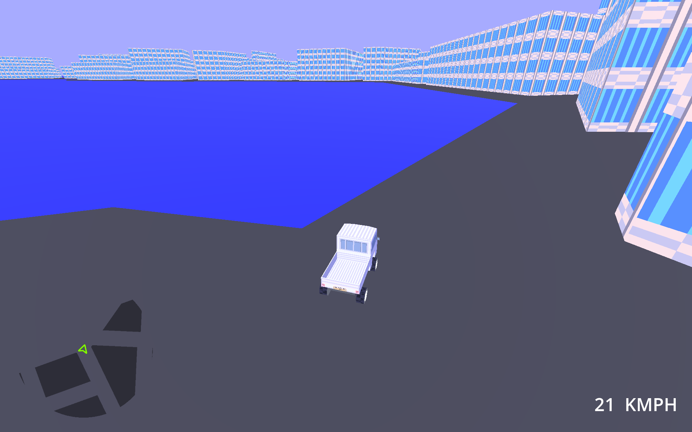
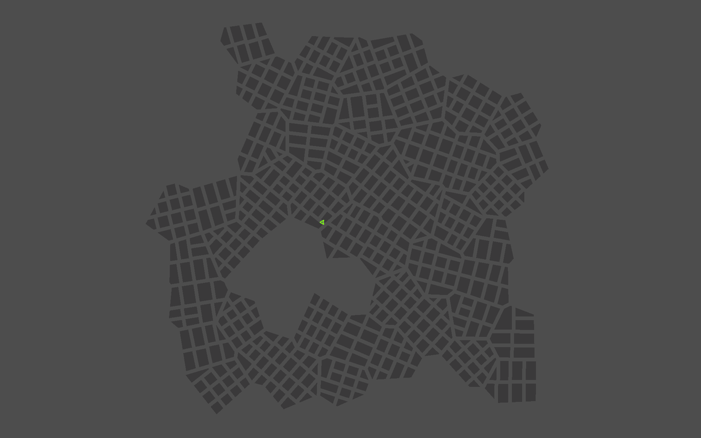

# Procedural City Generation and Driving Simulator in Godot
Drive through a procedurally-generated city using [OBB (Object Aligned Bounding Box) Parcelling](https://github.com/stavguo/obb-parcelling).



## Installation
Clone or save this repo locally ([instructions](https://docs.github.com/en/repositories/creating-and-managing-repositories/cloning-a-repository)), and then import it using Godot's [project manager](https://docs.godotengine.org/en/stable/tutorials/editor/project_manager.html).
## Usage
### Run Project
Within Godot, run the scene by pressing the Play Scene button in the top-right of the screen or press ```F6``` (```Cmd``` + ```R``` on macOS).
Every time the scene is run, a new city is randomly created.
### Controls
* ```Arrow-Keys```: Move truck forwards, backwards, left, or right.
* ```Spacebar```: Drift button 😈.
* ```M```: View map of city.
* ```R```: Generate new city.
* ```P```: Save screenshot of viewport to ```screenshots/```.
* ```Escape```: Exit game.
### Regenerate a City Island
To get a new city, you can press the ```R``` key to rerun the scene.
### Take a Screenshot
You can save a screenshot of the viewport to ```screenshots/``` by pressing the ```P``` key.
### Modify Variables
The main logic can be found in the script associated with the parent node, Node2D. The program can be easily configured by modifying the values found in the Godot node inspector tab with the parent node selected. The city block that is parcelled is created by generating ```N``` random points on the circumference of a circle of radius ```R```.
* ```max_radius``` (int): The maximum possible length of radius ```R```.
* ```min_radius``` (int): The minimum possible length of radius ```R```.
* ```points``` (int): The amount of points ```N``` to be generated on the circumference.
* ```min_area``` (int): Minimum area of parcel. Once area is less than ```min_area```, recursion ends and parcel is created.

## Roadmap
- [x] Finish car controller
- [x] Add colliders to buildings
- [x] Scale world to be larger and more accurate
- [ ] Add fast travel
- [x] Make island, surround with water
- [ ] Add parks
- [ ] Incorporate Godot Road Generator
- [ ] Add loading screen to beginning
- [ ] Implement shadows
- [ ] Building materials
    - [ ] Brick types
    - [ ] Window types
- [ ] Create mlutiple islands using noise:
    - [x] Poisson disc sample to generate points
    - [x] Use voronoi to form land blocks
    - [ ] Group land blocks together to form islands
- [ ] Use geometry to find closest island coast edge to create bridge
- [ ] Create toon shader
- [ ] Add skybox
- [ ] Add sound
- [ ] Improve speedometer/GUI
To register changes, press the ```Tab``` button on your keyboard after modifying an inspector field. Then save the changes and rerun the project.
## Credits
* This project was inspired by "[Procedural Generation of Parcels in Urban Modeling](https://www.cs.purdue.edu/cgvlab/papers/aliaga/eg2012.pdf)"
by Carlos A. Vanegas, Tom Kelly, Basil Weber, Jan Halatsch, Daniel G. Aliaga, and Pascal Müller.
* I found this paper by reading Martin Evans's [blogpost](https://martindevans.me/game-development/2015/12/27/Procedural-Generation-For-Dummies-Lots/).
* The method for creating the city blocks was inspired by Mitch Wheat's [stack overflow answer](https://stackoverflow.com/a/8997139).
* [Color palette](https://lospec.com/palette-list/curiosities) created by sukinapan
* [Kei truck model](https://skfb.ly/oHGXY) created by Fehungcom1
* [poisson-disc-sampling](https://github.com/udit/poisson-disc-sampling)
* [gdDelaunay](https://github.com/bartekd97/gdDelaunay)
